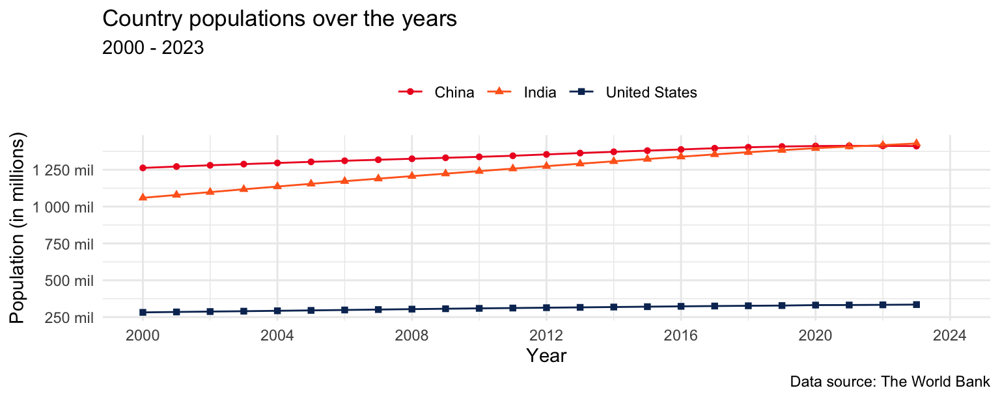

# Introduction

## Goal

Our ultimate goal in this application exercise is to make the following data visualization.

{fig-alt="Line plot of country populations for the United States, India, and China between 2000 and 2023." fig-align="center"}

## Packages

We will use the **tidyverse** and **scales** packages for data wrangling and visualization.

```{r}
#| message: false
library(tidyverse)
library(scales)
```

## Data

These data come from [The World Bank](https://databank.worldbank.org/reports.aspx?source=2&series=SP.POP.TOTL&country=#) and reflect population counts for the years 2000 to 2023.
The populations given are mid-year estimates.

```{r}
#| label: load-population-data
#| message: false
population <- read_csv(
    "https://data-science-with-r.github.io/data/population.csv"
)
```

Let's take a look at the data.

# Analysis


## Data prep

```{r}
#| label: popultaion-2023
population |>

```

## Tidying

-   What are the aesthetic mappings in the plot shown above, i.e., what pieces of information do we need represented as columns (variables) in our data frame in order to be able to recreate this plot?

x = Year
y = population
color = Country

-   Reshape the `population` data such that it can be used to recreate the plot above. Note: For now, you can keep all the countries in the dataset.

```{r}
#| label: pivot
population |>
    pivot_longer(
        cols = `2000`:`2023`,
        names_to = "year",
        values_to = "population"
    )
```

-   What is the type of the `year` variable? Why? What should it be?

Character. This is the default assumption that pivot_longer() makes with column names. Should be numeric.

-   Start over with pivoting, and this time also make sure `year` is a numerical variable in the resulting data frame. Save the resulting data frame as `population_longer`.

```{r}
#| label: pivot-better
population_longer <- population |>
    pivot_longer(
        cols = `2000`:`2023`,
        names_to = "year",
        values_to = "population",
        names_transform = as.numeric
    )

population_longer
```

## Visualization

-   Now we start making our plot, but let's not get too fancy right away. Create a line plot of populations of the United States, India, and China over the years. Represent the data with points and lines.

```{r}
#| label: line-plot
population_longer |>
    filter(country_name %in% c("United States", "India", "China")) |>
    ggplot(aes(x = year, y = population, color = country_name)) +
    geom_point() +
    geom_line()
```

-   What aspects of the plot need to be updated to go from the draft you created above to the goal plot at the beginning of this application exercise.

    - Different colors and shapes for each color
    - Plot needs to be wider and shorter
    - Labels
    - Legend doesn't need a label and moved to top of plot
    - Different theme to avoid gray background-- `theme_minimal()`

-   Use different shapes for each country's points.

```{r}
#| label: shapes
population_longer |>
    filter(country_name %in% c("United States", "India", "China")) |>
    ggplot(aes(
        x = year,
        y = population,
        color = country_name,
        shape = country_name
    )) +
    geom_point() +
    geom_line()
```

-   Update x-axis scale such that the years displayed go from 2000 to 2024 in increments of 4 years.

```{r}
#| label: x-axis
population_longer |>
    filter(country_name %in% c("United States", "India", "China")) |>
    ggplot(aes(
        x = year,
        y = population,
        color = country_name,
        shape = country_name
    )) +
    geom_point() +
    geom_line() +
    scale_x_continuous(limits = c(2000, 2024), breaks = seq(2000, 2024, by = 4))
```

-   Update the y-axis so it's scaled to millions and uses the same breaks as the goal plot.

```{r}
#| label: y-axis
population_longer |>
    filter(country_name %in% c("United States", "India", "China")) |>
    ggplot(aes(
        x = year,
        y = population,
        color = country_name,
        shape = country_name
    )) +
    geom_point() +
    geom_line() +
    scale_x_continuous(
        limits = c(2000, 2024),
        breaks = seq(2000, 2024, by = 4)
    ) +
    scale_y_continuous(
        breaks = seq(250000000, 1250000000, by = 250000000),
        labels = label_number(scale = 1 / 1000000000, suffix = " mil")
    )
```

-   Update colors for each country using the following level / color assignments.
    -   "United States" = "#0A3161"
    -   "India" = "#FF671F"
    -   "China" = "#EE1C25"

```{r}
#| label: colors
population_longer |>
    filter(country_name %in% c("United States", "India", "China")) |>
    ggplot(aes(
        x = year,
        y = population,
        color = country_name,
        shape = country_name
    )) +
    geom_point() +
    geom_line() +
    scale_x_continuous(
        limits = c(2000, 2024),
        breaks = seq(2000, 2024, by = 4)
    ) +
    scale_y_continuous(
        breaks = seq(250000000, 1250000000, by = 250000000),
        labels = label_number(scale = 1 / 1000000000, suffix = " mil")
    ) +
    scale_color_manual(
        values = c(
            "United States" = "#0A3161",
            "India" = "#FF671F",
            "China" = "#EE1C25"
        )
    )
```

-   Update the plot labels (`title`, `subtitle`, `x`, `y`, and `caption`) and use `theme_minimal()`.

```{r}
#| label: labels-theme
population_longer |>
    filter(country_name %in% c("United States", "India", "China")) |>
    ggplot(aes(
        x = year,
        y = population,
        color = country_name,
        shape = country_name
    )) +
    geom_point() +
    geom_line() +
    scale_x_continuous(
        limits = c(2000, 2024),
        breaks = seq(2000, 2024, by = 4)
    ) +
    scale_y_continuous(
        breaks = seq(250000000, 1250000000, by = 250000000),
        labels = label_number(scale = 1 / 1000000000, suffix = " mil")
    ) +
    scale_color_manual(
        values = c(
            "United States" = "#0A3161",
            "India" = "#FF671F",
            "China" = "#EE1C25"
        )
    ) +
    labs(
        title = "Country populations over the years",
        subtitle = "2000 - 2023",
        x = "Year",
        y = "Population (in millions)",
        caption = "Data source: The World Bank"
    ) +
    theme_minimal()
```

-   Finally, move the legend to the top of the plot and remove its label.

```{r}
#| label: country-populations-years
population_longer |>
    filter(country_name %in% c("United States", "India", "China")) |>
    ggplot(aes(
        x = year,
        y = population,
        color = country_name,
        shape = country_name
    )) +
    geom_point() +
    geom_line() +
    scale_x_continuous(
        limits = c(2000, 2024),
        breaks = seq(2000, 2024, by = 4)
    ) +
    scale_y_continuous(
        breaks = seq(250000000, 1250000000, by = 250000000),
        labels = label_number(scale = 1 / 1000000000, suffix = " mil")
    ) +
    scale_color_manual(
        values = c(
            "United States" = "#0A3161",
            "India" = "#FF671F",
            "China" = "#EE1C25"
        )
    ) +
    labs(
        title = "Country populations over the years",
        subtitle = "2000 - 2023",
        x = "Year",
        y = "Population (in millions)",
        caption = "Data source: The World Bank",
        color = NULL,
        shape = NULL
    ) +
    theme_minimal() +
    theme(legend.position = "top")
```
