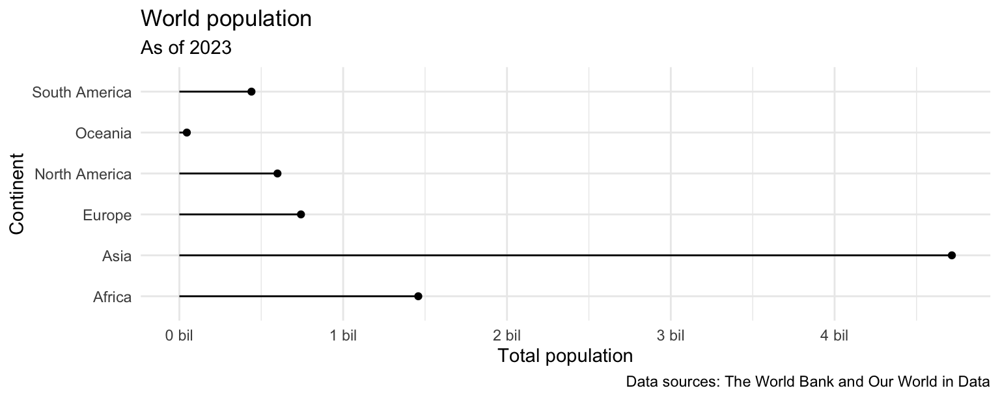

# Introduction

Our ultimate goal in this application exercise is to create a bar plot of total populations of continents, where the input data are:

1.  Countries and populations
2.  Countries and continents

## Packages

We will use the **tidyverse** and **scales** packages for data wrangling and visualization.

```{r}
#| message: false
library(tidyverse)
library(scales)
```

## Data

### Population

These data come from [The World Bank](https://databank.worldbank.org/reports.aspx?source=2&series=SP.POP.TOTL&country=#) and reflect population counts for the years 2000 to 2023.
The populations given are mid-year estimates.

```{r}
#| label: load-population-data
#| message: false
population <- read_csv("https://data-science-with-r.github.io/data/population.csv")
```

Let's take a look at the data.

```{r}
#| label: view-population-data
population
```

### Continents

These data come from [Our World in Data](https://ourworldindata.org/grapher/continents-according-to-our-world-in-data).

```{r}
#| label: load-continents-data
#| message: false
continents <- read_csv("https://data-science-with-r.github.io/data/continents.csv")
```

Let's take a look at the data.

```{r}
#| label: view-continents-data
continents
```

# Analysis

## Data prep

-   For this analysis we'll focus on the latest available population numbers -- 2023. Modify the `population` data frame to only include 2023 population numbers. Then, rename the column containing 2023 population numbers as `population`.

```{r}
#| label: population-2023
population <- population |> 
    select(country_name, country_code, `2023`) |>
    rename("population" = `2023`)
```

-   Which variable(s) will we use to join the `population` and `continents` data frames?

`population` data frame -> `country_code` variable
`continents` data frame _> `code` variable

-   We want to create a new data frame that keeps all rows and columns from `population` and brings in the corresponding information from `continents`. Which join function should we use?

`left_join()`, first data frame in pipeline is `population`

-   Join the two data frames and name assign the joined data frame to a new data frame `population_continents`.

```{r}
#| label: join-population-continents
population_continents <- population |>
    left_join(continents, by = join_by(country_code == code))
```

-   Take a look at the newly created `population_continent` data frame. There are some countries that were not in `continents`. First, identify which countries these are (they will have `NA` values for `continent`).

```{r}
#| label: data-inspect
population_continents |>
    filter(is.na(continent))
```

-   All of these countries are actually in the `continents` data frame, but under different names. So, let's clean that data first by updating the country names in the `population` data frame in a way they will match the `continents` data frame, and then joining them, using a `case_when()` statement in `mutate()`. At the end, check that all countries now have continent information.

```{r}
#| label: data-clean
population_continents <- population |>
    mutate(
        country_code = case_when(
            country_code == "CHI" ~ "OWID_CIS",
            country_code == "XKX" ~ "OWID_KOS",
            .default = country_code
        )
    ) |>
    left_join(continents, by = join_by(country_code == code))

population_continents |>
    filter(is.na(continent))
```

-   Which continent do you think has the highest population? Which do you think has the second highest? The lowest?

Add response here.

-   Create a new data frame called `population_summary` that contains a row for each continent and a column for the total population for that continent, in descending order of population. Note that the function for calculating totals in R is `sum()`.

```{r}
#| label: population-continents-sum
population_sumary <- population_continents |>
    group_by(continent) |>
    summarize(total_population = sum(population)) |>
    arrange(desc(total_population))
```

## Visualization

-   Make a bar plot with total population on the y-axis and continent on the x-axis, where the height of each bar represents the total population in that continent.

```{r}
#| label: population-summary-bar
# add code here
```

-   Recreate the following plot, which is commonly referred to as a **lollipop plot**. Hint: Start with the `point`s, then try adding the `segment`s, then add axis labels and `caption`, update the x scale.



```{r}
#| label: population-summary-lollipop-2023
# add code here
```

-   What additional improvements would you like to make to this plot.

Add response here.
