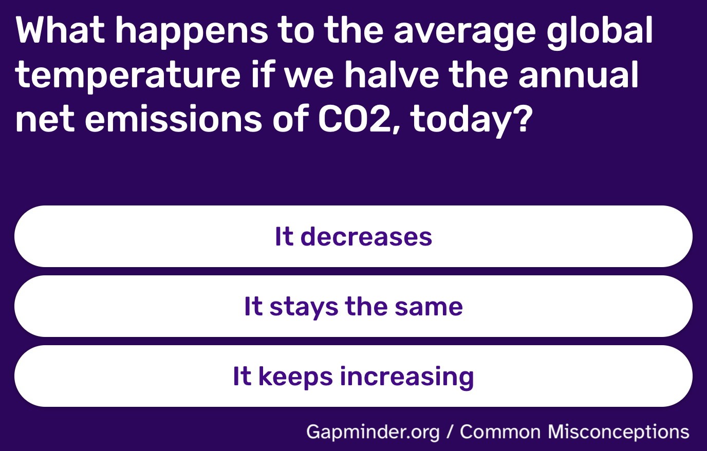
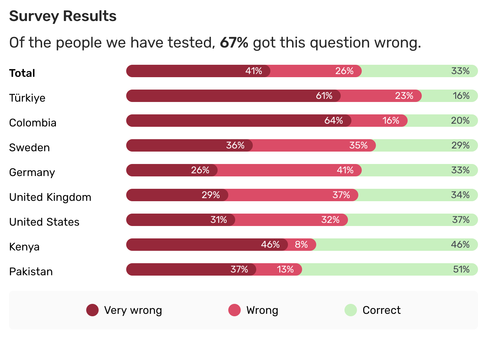

# Introduction

Visitors to [Gapminder.org](https://www.gapminder.org/) are welcomed with a question about common misconceptions.
Here is one of them.



Once you make your selection, you are directed to a page that explains the right answer and shows a visualization of the distribution of responses from various countries.



Our goal is to create a version of this visualization.

## Packages

We will use the **tidyverse** and **scales** packages for data wrangling and visualization.

```{r}
#| label: load-packages
#| message: false
library(tidyverse)
library(scales)
```

## Data

The data we're going to use is in a CSV file called `co2-emissions.csv` at <https://data-science-with-r.github.io/data/co2-emissions.csv>.

```{r}
#| label: load-data
co2_emissions <- read_csv("https://data-science-with-r.github.io/data/co2-emissions.csv")
```

And let's take a look at the data.

```{r}
#| label: view-data
co2_emissions
```

# Analysis

-   Pivot the `co2_emissions` data frame *longer* such that each row represents a country / answer type combination and `answer_type` and `percentage` for that country are columns in the data frame.

```{r}
#| label: pivot
co2_emissions_longer <- co2_emissions |>
    pivot_longer(
        cols = !country,
        names_to = "answer_type", 
        values_to = "percentage"
    )
```

-   Create a stacked bar plot of response type by countries.

```{r}
#| label: stacked-bar-plot
ggplot(co2_emissions_longer, aes(y = country, x = percentage, fill = answer_type)) +
    geom_col()
```

-   In the original plot, the levels of `answer_type` are in the order Very wrong, Wrong, and Correct. Update the previous plot reorder the levels in this order.

```{r}
#| label: reorder-answer-type
co2_emissions_longer |>
    mutate(answer_type = fct_rev(fct_relevel(answer_type, "Very wrong", "Wrong", "Correct"))) |>
    ggplot(aes(y = country, x = percentage, fill = answer_type)) +
    geom_col()
```

-   Update the colors of the plot to match the original plot:
    -   Very wrong: #96283A
    -   Wrong: #DB4C67
    -   Correct: #C8F0BF

```{r}
#| label: colors
co2_emissions_longer |>
    mutate(answer_type = fct_rev(fct_relevel(answer_type, "Very wrong", "Wrong", "Correct"))) |>
    ggplot(aes(y = country, x = percentage, fill = answer_type)) +
    geom_col() +
    scale_fill_manual(
        values = c(
            "Very wrong" = "#96283A",
            "Wrong" =  "#DB4C67",
            "Correct" = "#C8F0BF"
        )
    )
```

-   Move the legend to the bottom and make sure the levels appear in the same order they appear in the plot.

```{r}
#| label: move-legend
co2_emissions_longer |>
    mutate(answer_type = fct_rev(fct_relevel(answer_type, "Very wrong", "Wrong", "Correct"))) |>
    ggplot(aes(y = country, x = percentage, fill = answer_type)) +
    geom_col() +
    scale_fill_manual(
        values = c(
            "Very wrong" = "#96283A",
            "Wrong" =  "#DB4C67",
            "Correct" = "#C8F0BF"
        ),
        guide = guide_legend(reverse = TRUE)
    ) +
        theme(legend.position = "bottom")

```

-   Reorder countries to match the original plot -- in increasing order of corect percentages.

```{r}
co2_emissions_longer |>
    mutate(
        answer_type = fct_rev(fct_relevel(
            answer_type, 
            "Very wrong",
             "Wrong", 
             "Correct")),
    country = fct_rev(fct_relevel(
        country, 
        "Türkiye", 
        "Columbia", 
        "Sweden", 
        "Germany", 
        "United Kingdom", 
        "United States", 
        "Kenya", 
        "Pakistan")) 
    )|>
    ggplot(aes(y = country, x = percentage, fill = answer_type)) +
    geom_col() +
    scale_fill_manual(
        values = c(
            "Very wrong" = "#96283A",
            "Wrong" =  "#DB4C67",
            "Correct" = "#C8F0BF"
        ),
        guide = guide_legend(reverse = TRUE)
    ) +
        theme(legend.position = "bottom")
```

-   Update labels and other elements of the plot to get it closer to the original plot.

```{r}
#| label: update-labels
co2_emissions_longer |>
    mutate(
        answer_type = fct_rev(fct_relevel(
            answer_type, 
            "Very wrong",
             "Wrong", 
             "Correct")),
    country = fct_rev(fct_relevel(
        country, 
        "Türkiye", 
        "Columbia", 
        "Sweden", 
        "Germany", 
        "United Kingdom", 
        "United States", 
        "Kenya", 
        "Pakistan")) 
    )|>
    ggplot(aes(y = country, x = percentage, fill = answer_type)) +
    geom_col() +
    scale_fill_manual(
        values = c(
            "Very wrong" = "#96283A",
            "Wrong" =  "#DB4C67",
            "Correct" = "#C8F0BF"
        ),
        guide = guide_legend(reverse = TRUE)
    ) +
        theme(legend.position = "bottom")
```
