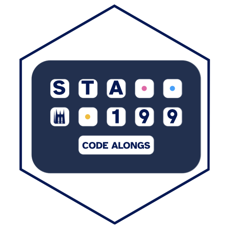

# code-alongs 

A template repo for those who want to follow along with the code along videos.

This repo is a **template**, which means you make your own copy of it and then work in your copy.
That way you get your own place to write, save, commit, and push your work as you follow along with the videos.

## 1. Create your own repo from this template

1. Go to <https://github.com/sta199/code-alongs>.
2. Click the green **Use this template** button, then **Create a new repository**.
3. Under **Owner**, choose the **sta199-f26** organization.
4. Name the repo `code-alongs-yourname` (replace `yourname` with your GitHub username or your name).
5. Keep the repo **private**, then click **Create repository**.

You now have your own copy of all the code along files.

## 2. Clone your repo

On your new repo's page, click the green **Code** button and copy the HTTPS URL.

Then, in Positron:

1. Go to **File** > **New Folder from Git...**
2. Paste the URL of your repo.
3. Choose where on your computer to put the folder, and click **Open** to open it in Positron.

## 3. Work on the code alongs

Open the `.qmd` file for the video you're watching, fill in the code as you go, and render it.

As you work, commit and push your changes so your work is saved on GitHub:

- Open the **Source Control** pane in the sidebar.
- **Stage** the files you changed by clicking the **+** next to them.
- Write a short **commit** message and click **Commit**.
- Click **Sync Changes** to send your commits to GitHub.

This is good practice for the same workflow you'll use on labs and homework, and it means your work is backed up and available from any computer.
